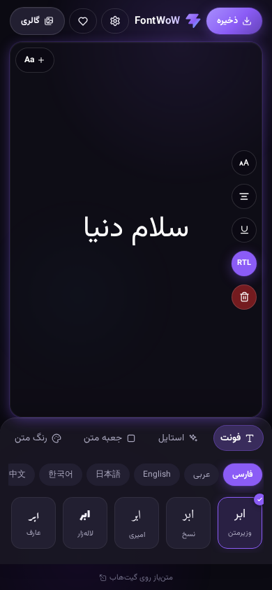
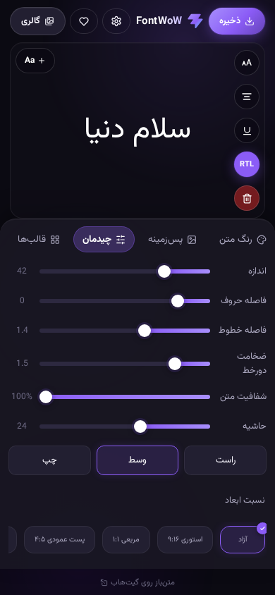
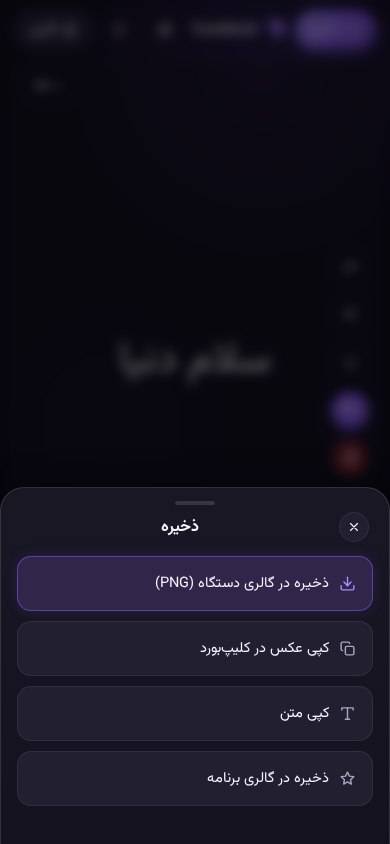

<div align="center">


# FontWoW

**استودیوی جادویی تایپوگرافی و متن‌آرایی آنلاین ⚡**

*بنویس، استایل بده، عکس بگیر، انیمیشن بساز و به اشتراک بگذار!*

---

[](https://github.com/FontWoW/FontWoW.github.io/actions/workflows/deploy.yml)
[](https://github.com/FontWoW/FontWoW.github.io/actions/workflows/security.yml)
[](https://github.com/FontWoW/FontWoW.github.io/actions/workflows/zap-scan.yml)
[](https://react.dev/)
[](https://vitejs.dev/)
[](https://capacitorjs.com/)
[](LICENSE)

🌐 **[نسخه وب آنلاین (فارسی و انگلیسی)](https://fontwow.github.io)** | 📱 **[دریافت مستقیم نسخه اندروید (APK)](https://github.com/FontWoW/FontWoW.github.io/releases)**

<br />

<table>
  <tr>
    <td align="center">
      <kbd><b>ویرایشگر اصلی</b></kbd><br />
      
    </td>
    <td align="center">
      <kbd><b>چیدمان و ابعاد</b></kbd><br />
      
    </td>
    <td align="center">
      <kbd><b>خروجی و قالب‌ها</b></kbd><br />
      
    </td>
  </tr>
</table>

</div>

---

<div dir="rtl">

## 🌟 معرفی پروژه

**FontWoW (فونت واو)** یک ابزار متن‌آرایی و تایپوگرافی مدرن، متن‌باز، کاملاً کلاینت‌ساید (بدون نیاز به سرور) و بهینه‌سازی شده برای موبایل است. با فونت واو می‌توانید در چند ثانیه نوشته‌های خود را با افکت‌ها، فونت‌های متنوع فارسی و زبان‌های دیگر بیارایید، استیکرها و عکس‌های دلخواه اضافه کنید، آن‌ها را بچرخانید و جابه‌جا کنید و در نهایت خروجی‌های بسیار باکیفیت تصویری (PNG) یا انیمیشن‌های جذاب (GIF و ویدیوهای WebM) بگیرید.

> [!NOTE]
> 🔒 **حریم خصوصی ۱۰۰٪ تضمین شده:** تمام فعالیت‌ها، طرح‌های ذخیره‌شده، تنظیمات و فونت‌های شخصی شما فقط و فقط روی مرورگر یا حافظه دستگاه شما ذخیره می‌شوند (`localStorage` و حافظه محلی). هیچ داده‌ای به هیچ سروری ارسال نمی‌شود و برنامه کاملاً مستقل کار می‌کند.

---

## ✨ ویژگی‌های برجسته و امکانات

### 🔠 مدیریت و سفارشی‌سازی فونت
* **مجموعه‌ای از فونت‌های استاندارد:** شامل ده‌ها فونت پیش‌فرض و آماده، دسته‌بندی‌شده بر اساس زبان (فارسی، عربی، انگلیسی، ژاپنی، کره‌ای، چینی، روسی، هندی و غیره).
* **آپلود فونت شخصی:** پشتیبانی کامل از فرمت‌های رایج فونت (`ttf` / `otf` / `woff` / `woff2`)؛ فونت‌های آپلود شده در مرورگر شما ذخیره و به لیست فونت‌ها اضافه می‌شوند.
* **جستجو در گوگل فونت:** امکان جستجو و بارگیری مستقیم هزاران فونت از مخزن بزرگ Google Fonts با قابلیت کش هوشمند برای استفاده در دفعات بعدی بدون نیاز به اینترنت.
* **حمایت و پیشنهاد فونت:** فرم اختصاصی پیشنهاد فونت‌های جدید با پشتیبانی از تخفیف‌های ویژه (مانند حمایت ۲۰ درصدی فونت‌ایران برای خرید فونت‌ها).

### 🎨 استایل متن و جلوه‌های ویژه
* **قالب‌بندی استاندارد:** تنظیمات سریع برای ضخیم (Bold)، کج (Italic)، خط زیر (Underline)، تراز متن و شفافیت (Opacity).
* **افکت‌های متن پیشرفته:**
  * 🌈 **افکت گرادیان:** اعمال گرادیان‌های رنگی پویا روی حروف متن.
  * 🔮 **افکت نئون:** ایجاد درخشش‌های نئونی خیره‌کننده با کنترل شدت.
  * 🗺️ **متن روی مسیر (Curve Text):** قرار دادن متن روی خطوط منحنی، قوس، موج و دایره با قابلیت تنظیم دقیق شدت و جهت انحنا.
  * 🧱 **سایه‌های سه‌بعدی (3D Shadows):** افکت سایه سه‌بعدی عمیق و طویل با زاویه، عمق و رنگ دلخواه.
  * 🖼️ **ماسک تصویر (Image Fill):** پر کردن داخل حروف با تصویر پس‌زمینه دلخواه شما.
  * 📐 **کشیدگی هوشمند:** کشیدن خودکار و هوشمند حروف فارسی برای زیبایی بیشتر چیدمان سنتی.

### 🖼️ جعبه‌های متن و قاب‌ها
* **انواع استایل جعبه:** ساده، جعبه رنگی یکدست، کادر دور، شیشه‌ای (Glassmorphism) و زیرخط ضخیم.
* **تنظیمات دقیق:** کنترل ابعاد جعبه، میزان حاشیه‌ها (Padding)، گوشه‌های گرد (Border Radius) و رنگ آن.

### 🪄 ابزارهای هوشمند و جادویی
* **چیدمان جادویی:** ساخت خودکار چندین ترکیب‌بندی حرفه‌ای و مرتب‌سازی خودکار لایه‌ها تنها با یک لمس.
* **قالب‌های آماده:** تب ویژه قالب‌ها با پیش‌نمایش زنده از ترکیب‌های زیبای پس‌زمینه، فونت، افکت و جعبه برای شروع سریع.
* **حذف پس‌زمینه استیکر:** ابزار محلی و هوشمند برای حذف پس‌زمینه تصاویر و استیکرها به صورت کاملاً آفلاین و بدون ارسال تصویر به سرور.

### 📂 بوم چند لایه‌ای تعاملی (Multi-Layer Canvas)
* **لایه‌های متنی و تصویری نامحدود:** افزودن بی‌شمار لایه متنی مستقل (`＋ Aa`) و تصاویر/استیکرهای شخصی از گالری گوشی (`＋`).
* **تعامل لمسی پیشرفته:** کشیدن و رها کردن (Drag)، چرخش روان با دستگیره اختصاصی، تغییر اندازه (Scale) لایه‌ها، ویرایش متن با دابل‌کلیک و حذف آسان با دکمه ضربدر (`✕`).

### 🌅 پس‌زمینه و فیلترهای بوم
* **انواع پس‌زمینه:** استفاده از رنگ‌های ساده، گرادیان‌های زیبا، الگوهای آماده یا آپلود عکس پس‌زمینه دلخواه.
* **فیلترهای عکس پس‌زمینه:** اعمال بلور (Blur)، تغییر میزان روشنایی، کنتراست، سیاه و سفید کردن و فیلترهای دیگر روی عکس پس‌زمینه.
* **ابعاد استاندارد شبکه‌های اجتماعی:** نسبت تصویرهای از پیش تعریف شده از جمله استوری (۹:۱۶)، پست مربعی (۱:۱)، پست عمودی (۴:۵)، لندسکیپ (۱۶:۹) و حالت آزاد.

### 💾 ذخیره‌سازی و خروجی‌های متنوع
* **خروجی PNG با کیفیت بالا:** خروجی بدون هیچ‌گونه افت کیفیت؛ برنامه تضمین می‌کند هیچ‌کدام از ابزارهای ادیتور داخل عکس خروجی نیفتد.
* **خروجی متحرک (GIF و WebM):** ذخیره طرح به همراه انیمیشن‌های ورود جذاب مانند افکت تایپ، محوشدن (Fade)، بالا آمدن (Rise) یا بزرگ‌نمایی (Zoom).
* **عملیات کپی:** کپی مستقیم تصویر در کلیپ‌بورد سیستم یا کپی متن ساده‌ی روی بوم.
* **گالری داخلی برنامه:** ذخیره فایل پروژه در گالری داخلی مرورگر برای بازگشت و ویرایش دوباره در دفعات بعد.

### 📱 طراحی مدرن و بومی (UI/UX)
* **تم تاریک شفق قطبی (Aurora):** رابط کاربری بنفش مدرن با انیمیشن‌های نرم SVG و شفق‌های رنگی متحرک در پس‌زمینه.
* **سفارشی‌سازی رنگ پوسته:** انتخاب از میان ۸ رنگ تم جذاب؛ کل رابط کاربری (لوگو، اسلایدرها، دکمه‌ها و درخشش‌ها) بلافاصله به رنگ انتخابی شما تغییر رنگ می‌دهند.
* **سازگاری بالا:** پشتیبانی کامل از ترجیح کاهش انیمیشن کاربر (`prefers-reduced-motion`).
* **عیب‌یابی پیشرفته (Diagnostics):** صفحه مانیتورینگ سلامت برنامه برای بررسی وضعیت حافظه مرورگر، کش فونت‌ها، تست شبکه و مشاهده/کپی لاگ‌ها برای اشکال‌زدایی.

---

## 🛠️ ساختار پوشه‌های پروژه

توسعه پروژه بر پایه ساختار زیر انجام می‌شود:

```text
fontwow/
├── android/               # پروژه اندروید بومی (کاپاسیتور)
├── docs/                  # مستندات و راهنماهای پروژه
├── public/                # دارایی‌های استاتیک و آیکون برنامه
├── src/
│   ├── App.jsx            # هسته اصلی منطق و رابط کاربری ادیتور
│   ├── App.css            # استایل‌های اصلی، انیمیشن‌ها و توکن‌های طراحی
│   ├── ShareKit.jsx       # ابزارها و کادرهای اشتراک‌گذاری و خروجی
│   ├── ShareKit.css       # استایل‌های مربوط به بخش اشتراک‌گذاری
│   ├── native.js          # کدهای واسط بین وب و امکانات بومی دستگاه (Capacitor)
│   ├── logger.js          # ثبت و عیب‌یابی لاگ‌های سیستم
│   ├── fonts.js           # مدیریت فونت‌ها، پس‌زمینه‌ها و قالب‌ها
│   ├── strings.js         # متون ترجمه‌شده برنامه (فارسی / انگلیسی)
│   ├── index.css          # فونت‌ها و توکن‌های پایه عمومی
│   └── main.jsx           # نقطه ورود ری‌اکت (React 19)
├── package.json           # وابستگی‌ها و اسکریپت‌های پروژه
└── vite.config.js         # پیکربندی ابزار بیلد Vite 8
```

---

## 💻 راه‌اندازی و توسعه محلی

پروژه به هیچ پایگاه داده یا بک‌اندی نیاز ندارد. برای راه‌اندازی نسخه توسعه وب مراحل زیر را دنبال کنید:

1. **کلون کردن پروژه:**
   ```bash
   git clone https://github.com/FontWoW/FontWoW.github.io.git
   cd FontWoW.github.io
   ```

2. **نصب وابستگی‌ها:**
   ```bash
   npm install
   ```

3. **اجرای سرور توسعه وب:**
   ```bash
   npm run dev
   ```
   برنامه روی آدرس محلی `http://localhost:5173` باز خواهد شد.

4. **اسکریپت‌های مفید دیگر:**
   ```bash
   npm run lint     # بررسی خطاها و مشکلات کدهای پروژه (oxlint)
   npm run build    # بیلد و بهینه‌سازی پروژه برای انتشار نهایی در پوشه dist/
   npm run preview  # پیش‌نمایش نسخه نهایی بیلد شده
   ```

### 📱 توسعه و ساخت نسخه اندروید (Capacitor)
برای ساخت و تست نسخه اندروید روی شبیه‌ساز یا دستگاه واقعی:
```bash
# بیلد وب ابتدا اجرا شود
npm run build

# همگام‌سازی کدهای فرانت‌اند با بخش بومی اندروید
npx cap sync android

# ساخت فایل نصبی APK خط فرمان اندروید
cd android && ./gradlew assembleDebug
```

---

## 🗺️ راهنمای توسعه‌دهندگان (مهم)

> [!IMPORTANT]
> **قانون طلایی خروجی بوم (`.stage-inner`):**
> کتابخانه `html-to-image` مستقیماً کدهای داخل تگ با کلاس `.stage-inner` را به عکس تبدیل می‌کند. به همین دلیل، **هیچ عنصر کنترلی، دستگیره تغییر اندازه، کادر لایه یا دکمه‌های حذف (UI) نباید داخل این کلاس رندر شوند.** تمام ابزارهای کنترلی باید در خارج از این کانتینر یا به عنوان فرزندان غیر مستقیم که در خروجی رندر نمی‌شوند پیاده‌سازی گردند تا خروجی نهایی کاربر تمیز و بدون المان‌های مزاحم باشد.

### 🌐 چندزبانه بودن (i18n)
تمام رشته‌های متنی در فایل [`src/strings.js`](src/strings.js) نگهداری می‌شوند. در صورت تمایل به افزودن زبان جدید:
1. آبجکت جدید زبان (مثلاً `ar`) را ایجاد کرده و تمامی کلیدهای موجود را ترجمه کنید.
2. دکمه زبان جدید را در بخش تنظیمات [`src/App.jsx`](src/App.jsx) اضافه کنید.
3. در صورت راست‌به‌چپ (RTL) بودن زبان جدید، کد آن را در منطق تشخیص `dir` فایل `App.jsx` قرار دهید.

---

## 🔒 امنیت پروژه
کد برنامه به همراه نسخه‌های آنلاین به صورت مستمر و خودکار اسکن می‌شوند:
- اسکن امنیتی و تحلیل ایستای کد با **GitHub CodeQL**
- اسکن آسیب‌پذیری بسته‌های توسعه و وابستگی‌ها (Dependencies)
- اسکن تست نفوذ پویا به کمک **OWASP ZAP**

در صورت شناسایی هرگونه آسیب‌پذیری امنیتی، لطفاً مطابق با دستورالعمل‌های نوشته‌شده در فایل [`SECURITY.md`](SECURITY.md) گزارش خود را به صورت خصوصی ارسال کنید.

---

## 📄 مجوز و قوانین انتشار
این پروژه تحت مجوز آزاد **[GPL-3.0](LICENSE)** منتشر شده است. شما می‌توانید آزادانه پروژه را دانلود کرده، تغییر داده و گسترش دهید؛ مشروط بر اینکه تغییرات شما نیز تحت همین مجوز و به صورت متن‌باز منتشر شوند.

---

## 📚 پیوندهای مستندات پروژه
جهت بررسی عمیق‌تر هر یک از بخش‌های توسعه، مستندات زیر را مطالعه فرمایید:
* 🤝 **[راهنمای مشارکت در پروژه](CONTRIBUTING.md)**
* 💻 **[راه‌اندازی و توسعه فنی](docs/DEVELOPMENT.md)**
* 🏗️ **[مستندات معماری نرم‌افزار](docs/ARCHITECTURE.md)**
* 🧪 **[راهنمای نوشتن و اجرای تست‌ها](docs/TESTING.md)**
* 🚀 **[فرآیند انتشار و نسخه‌گذاری](docs/RELEASING.md)**
* 👥 **[منشور رفتاری توسعه‌دهندگان](CODE_OF_CONDUCT.md)**
* 🛡️ **[خط‌مشی امنیت پروژه](SECURITY.md)**
* 💬 **[پشتیبانی و رفع اشکال](SUPPORT.md)**

</div>

---

## 🇬🇧 English

<div align="center">
  <h3>FontWoW</h3>
  <p><b>Online Typography Studio — Type, Style, Export, and Animate! ⚡</b></p>
</div>

**FontWoW** is a privacy-first, serverless, mobile-optimized typography editor. You can style text with custom fonts, colors, gradients, and neon glows, place text on curves, add custom stickers, rotate and scale layers, and export high-quality PNGs or animated GIFs and WebM videos.

All processing and saving happen purely client-side using `localStorage`.

### 🚀 Key Features

* **Font Hub:** Handpicked multi-lingual fonts, custom font uploads, and Google Fonts integration with persistent caching.
* **Special Effects:** Gradients, neon glows, curving/wavy text, 3D shadows, image mask typography, and smart Kashida for Arabic script.
* **Canvas layers:** Multiple text and image/sticker layers with full drag, rotate, and scale gestures.
* **Exports:** Transparent/colored PNGs, animated WebM/GIFs with fade, rise, zoom, or typewriter intros, and copy-to-clipboard functionality.
* **Design & Theme:** Responsive Violet Aurora dark theme, 8 changeable accent colors, diagnostics dashboard, and i18n switching.

### 💻 Quick Start

```bash
npm install
npm run dev      # Local dev server
npm run lint     # Linting with oxlint
npm run build    # Production build
```

### 📱 Android Integration

```bash
npm run build
npx cap sync android
cd android && ./gradlew assembleDebug
```

For technical guidelines, architecture, and contribution workflows, please check the [Persian documentation above](#fontwow) or refer to the files in the [`docs/`](docs/) folder.

**Licensed under [GPL-3.0](LICENSE).**
